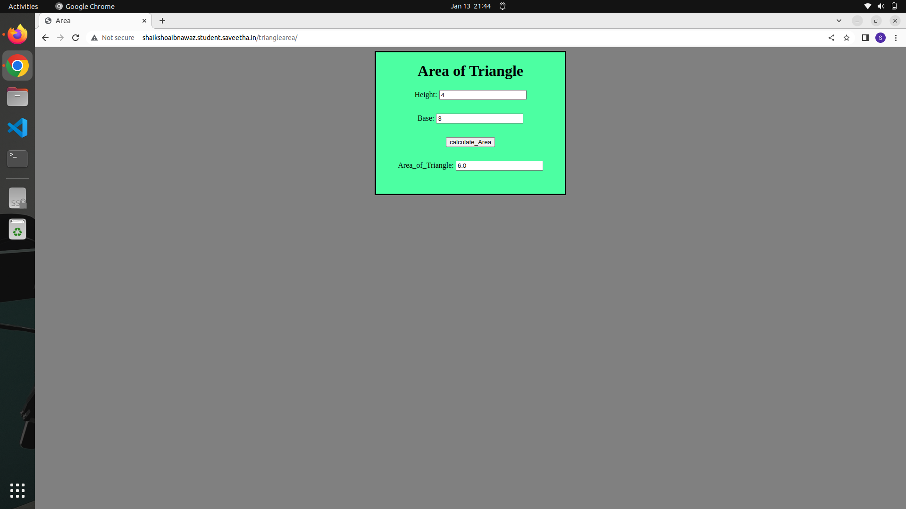
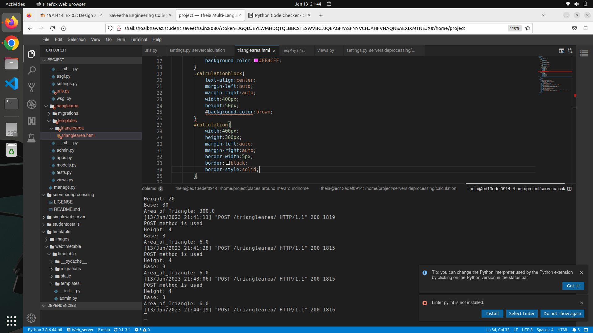
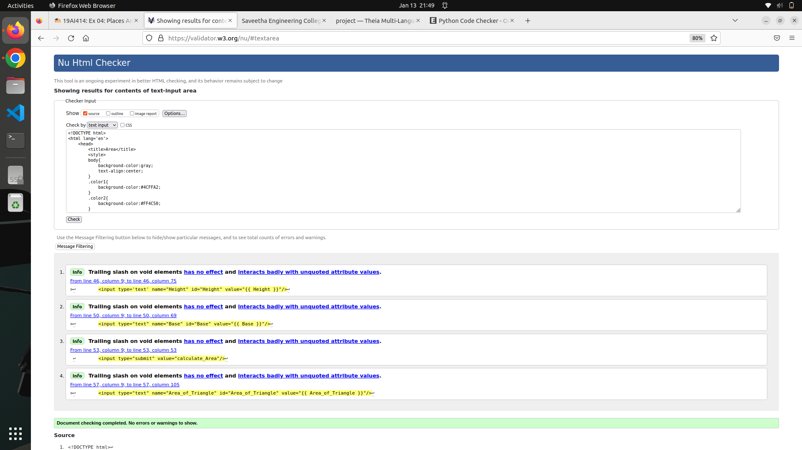

# Design a Website for Server Side Processing

## AIM:
To design a website to perform mathematical calculations in server side.

## DESIGN STEPS:

### Step 1:
clone the repository from github and create new django project servercalculation, in that create new app called trianglearea
and make changes in settings.py near ALLOWED_HOST and INSTALLED_APP 


### Step 2:
After creating app create templates folder in app folder,then in that folder again create trianglearea folder in that create html files with proper styling using css


### Step 3:
And then define your views with python content in views.py and define path in urls.py


### Step 4:
Then Run Your server and check whether the website is opening and calculating the area of tiangle in a correct way


### Step 5:
If it is working successfully then take pics of output and push changes to github

## PROGRAM :
```
<!DOCTYPE html>
<html lang='en'>
    <head>
        <title>Area</title>
        <style>
        body{
            background-color:gray;
            text-align:center;
        }
        .color1{
            background-color:#4CFFA2;
        }
        .color2{
            background-color:#FF4C50;
        }
        .color3{
            background-color:#FB4CFF;
        }
        .calculationblock{
            text-align:center;
            margin-left:auto;
            margin-right:auto;
            width:400px;
            height:50px;
            #background-color:brown;
        }
        #calculation{
            width:400px;
            height:300px;
            margin-left:auto;
            margin-right:auto;
            border-width:5px;
            border:black;
            border-style:solid;
        }

        </style>
    </head>
    <body >
        <div id="calculation" class="color1">
        <h1>Area of Triangle</h1>
        <form method="POST">
            
        <div class="calculationblock">
        <label for="Height">Height:</label>
        <input type='text' name="Height" id="Height" value="{{ Height }}"/>
        </div>
        <div class="calculationblock">
        <label for="Base">Base:</label>
        <input type="text" name="Base" id="Base" value="{{ Base }}"/>
        </div>
        <div class="calculationblock"> 
        <input type="submit" value="calculate_Area"/>
        </div>
        <div class="calculationblock">
        <label for="Area_of_Triangle">Area_of_Triangle:</label>
        <input type="text" name="Area_of_Triangle" id="Area_of_Triangle" value="{{ Area_of_Triangle }}"/>
        </div>
        </form>
      </div>
    </body>

</html> 
```

## OUTPUT:
### Client Side Output:

### Server Side Output:

### Validation Certificate:



## Result:
Thus the mathematical calculation in server side is successfully executed

